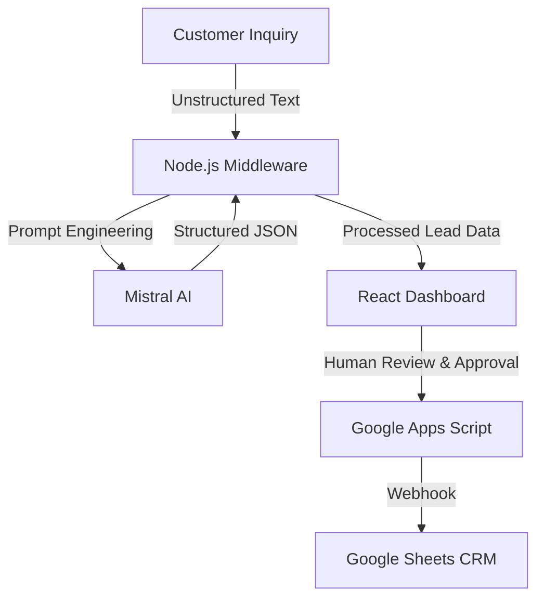

# ⚡ Global Lead‑Gen Engine

### Bilingual AI Middleware for Automated Lead Triage


---

## 🌍 Overview

**Global Lead‑Gen Engine** is a **bilingual AI middleware system**
designed to solve a major problem in small business operations:

> **Lead Decay** --- losing potential customers because responses are
> too slow.

Studies show that businesses can lose **up to 60% of potential revenue**
when they fail to respond within the **first hour**.

This platform automates the **first‑contact triage process**,
transforming messy inquiries into structured insights and draft
responses using **AI + human approval**.

---

# 🎯 The Problem

Small and medium businesses often struggle with:

- Slow response times to new leads
- Disorganized email inquiries
- Language barriers in bilingual markets
- Expensive CRM systems
- Manual qualification workflows

The result:

- Lost leads
- Lost revenue
- Operational inefficiency

---

# 💡 The Solution

This project builds an **AI-powered lead triage middleware** that:

1.  Ingests **unstructured inquiries**
2.  Uses **Mistral AI** to analyze intent and urgency
3.  Categorizes leads automatically
4.  Generates **editable professional responses**
5.  Pushes qualified leads into a lightweight CRM

The system keeps **humans in the loop** to maintain quality while
drastically speeding up response times.

---

# 🏗 System Architecture



---

# 🚀 Key Features

## 🧠 Bilingual Lead Intelligence

- **Automatic Language Detection** (English / Spanish)
- **Lead Temperature Classification**
  - 🔥 Hot
  - 🌤 Warm
  - ❄ Cold
- **Intent extraction** from messy inquiries
- **Clean summaries** for quick review

---

## 👨‍💼 Human‑in‑the‑Loop Workflow

AI never sends messages automatically.

It generates:

- A **3‑sentence professional response**
- An **editable draft**
- A **one‑click approval flow**

This ensures:

- Speed
- Accuracy
- Human oversight

---

## 🛡 Production‑Grade Infrastructure

### Persistence

Uses **localStorage** to prevent work loss during refresh.

### API Protection

Backend **rate limiting** prevents:

- Abuse
- Cost spikes
- API exhaustion

### Localization

Full **English / Spanish UI toggle** for international teams.

---

# 🛠 Tech Stack

Layer Technology Purpose

---

Frontend React Responsive SaaS dashboard
Styling TailwindCSS v4 Fast UI development
Backend Node.js + Express Middleware + API security
AI Engine Mistral AI Intent analysis & reasoning
Validation Zod Guaranteed JSON structure
Integration Google Apps Script Serverless CRM bridge
Database Google Sheets Lightweight CRM system

---

# 📊 Live Demo

- Live Application: Not deployed
- CRM Data: [View CRM Spreadsheet](https://docs.google.com/spreadsheets/d/1ZTFNug87U_v3bem7noO_GXXC-go98gk5jcP0QhwAF2k/edit?usp=sharing)
- API Endpoint: Not configured

---

# 🧠 Strategic Engineering Decisions

## Middleware over Client‑Side AI

AI logic runs on a **Node.js backend** rather than the browser.

Benefits:

- Protects API keys
- Enables rate limiting
- Prevents billing abuse
- Adds future scalability

---

## Data Sovereignty

Using **Mistral AI** helps align with **European data privacy standards
(GDPR)**.

This makes the project attractive for:

- EU businesses
- privacy‑sensitive industries

---

## Opex‑First Design

Instead of recommending a **\$100+/month CRM**, this project uses:

**Google Sheets as a database**

Advantages:

- \$0/month starting cost
- familiar interface
- easy export / migration

---

# 🧑‍💻 Installation

## 1️⃣ Clone Repository

```bash
git clone https://github.com/joelcasado-tech/global-lead-gen-engine.git
```

---

## 2️⃣ Backend Setup

Navigate to backend directory:

```bash
cd backend
```

Create environment file:

    MISTRAL_API_KEY=your_api_key_here

Install dependencies and start server:

```bash
npm install
node server.js
```

---

## 3️⃣ Frontend Setup

Navigate to frontend directory:

```bash
cd frontend
```

Install dependencies:

```bash
npm install
```

Run development server:

```bash
npm run dev
```

---

# 📂 Project Structure

    global-lead-gen-engine
    │
    ├── backend
    │   ├── server.js
    │   ├── routes
    │   └── middleware
    │
    ├── frontend
    │   ├── components
    │   ├── pages
    │   └── styles
    │
    └── integrations
        └── google-apps-script

---

# 🤝 Contributing

Pull requests are welcome!

For major changes:

1.  Fork the repository
2.  Create a feature branch
3.  Submit a PR

---

# 📜 License

This project is licensed under the **MIT License**.
